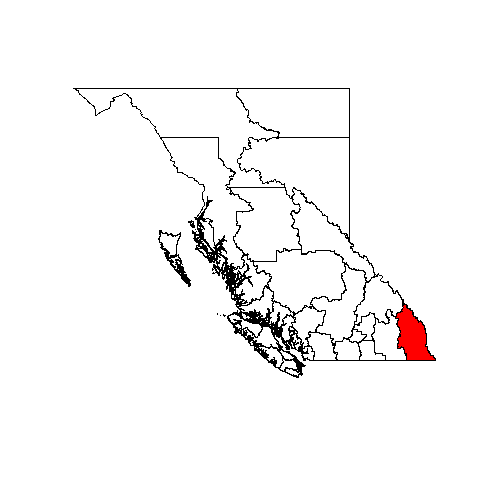

---
title:
output: 
  revealjs::revealjs_presentation:
    theme: night
    transition: slide
    highlight: espresso
---

## <divs> R for BC Stats </divs>

## Introduction to R

R has an extensive history as a tool for statistical analysis in academia. Due to relatively recent development efforts such as RStudio and "tidyverse," R is now more approachable and user friendly than ever before. 

## Benefits of R to BC Stats

> - Highly customizable data visualization; beyond the capabilities of Excel
> - One stop shop for projects; allows for data manipulation and tabulation, regression analysis, and results sharing in an integrated fashion
> - Requires significant investment of time and effort initially, but promotes the creation of easily reproducible workflows
> - Enables collaboration on projects both with individuals inside and outside of the organization
> - High degree of compatibility with Microsoft Office suite and other software packages currently in use

## Sample tasks well suited for R

> - Run SQL-like queries on an imported dataset
> - Produce various types of graphs and charts, with the option of very precise controls on the aesthetics 
> - Easily generate maps highlighting numerical attributes across different economic regions
> - Generate PDF reports in batch
> - Create dynamic web applications to present survey results

## {data-background-video="www/migrationApp.webm" data-background-video-loop="true"}

## Current projects

> - WES Engagement Migration Survey app
> - BC Public Service Career Survey app
> - Career survey batch summary reports
> - Re-usable presentation templates
> - Data visualization for various reports
> - Census survey batch profile maps
> - 

## Data Manipulation {data-transition="slide-in fade-out"}

 

## Data Manipulation {data-transition="fade-in slide-out"}


```{r, echo=5 , message=FALSE}
library(dplyr)
library(gapminder)
library(knitr)

lifeData <- gapminder %>% filter(year == 2007) %>%
  group_by(continent) %>%
  summarise(meanLifeExp = mean(lifeExp)) 

kable(lifeData, 
      digits = 2, 
      col.names = c("Continent", "Life Expectancy"),
      align = c('l','c')
      )

```

## Data visualisation

```{r, echo=3, message=FALSE, fig.width=7, fig.height=3.5}
library(ggplot2)

ggplot(data = gapminder %>% filter(continent == "Americas"), 
       aes(x=year, y=lifeExp)) + 
  geom_point(alpha = 0.3, size = 4, colour = "Blue") +
  theme_minimal() +
  geom_smooth(method = 'lm') +
  labs(title = "Increasing Life Expectancy in the Americas")
  

```

## Resources

R can be downloaded from https://cran.r-project.org/

RStudio is available at https://www.rstudio.com/products/rstudio/download/

There are numerous resources available to learn R. http://www.cookbook-r.com/ is a useful resource with clear and concise examples of various basic tasks in R. In addition, http://stackexchange.com/ contains numerous queries and solutions that are relevant to a lot of issues a regular R user can face. In general, the vast R community online is extremely helpful in aiding new users learn the software. 